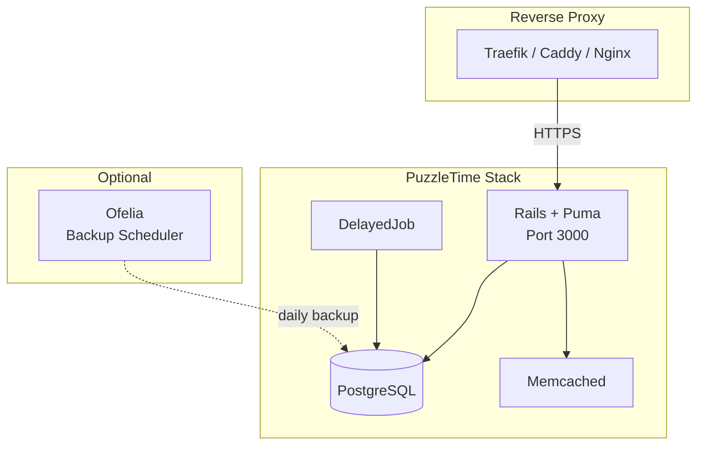

# PuzzleTime Production Deployment

Deploy PuzzleTime using Docker Compose for small companies and homelabs.

## Architecture



## Overview

This deployment includes:

- **Rails application** with Puma web server
- **DelayedJob** for background processing
- **PostgreSQL** database with persistent storage
- **Memcached** for caching
- **Ofelia** for scheduled backups (optional — can use existing instance)

## Prerequisites

- Docker Engine 20.10+
- Docker Compose v2
- A reverse proxy for HTTPS (see [Reverse Proxy Options](#reverse-proxy-options))
- Domain name with DNS pointing to your server (for SSL)

## Quick Start

```bash
# 1. Clone the repository
git clone https://github.com/puzzle/puzzletime.git
cd puzzletime/deploy

# 2. (Optional) Use community image with ARM64 support
#    Edit docker-compose.prod.yml and change image to:
#    ghcr.io/theoweiss/puzzletime:improve-theo

# 3. Run setup (generates secrets, initializes database, creates admin user)
./bin/setup.sh

# 4. Configure your reverse proxy (see docs/)

# 5. Access PuzzleTime and login with your admin credentials
```

The setup script will:
1. Generate secure passwords and secrets
2. Initialize the database
3. Prompt you to create an admin user (or use `ADMIN_*` env vars for automation)

## Docker Images

By default, `docker-compose.prod.yml` uses `ghcr.io/puzzle/puzzletime:latest`.

### Available Images

| Image | Description |
|-------|-------------|
| `ghcr.io/puzzle/puzzletime:latest` | Official release (when available) |
| `ghcr.io/theoweiss/puzzletime:improve-theo` | Community build with deployment improvements |
| `ghcr.io/theoweiss/puzzletime:latest` | Community build (latest main branch) |

### Using an Alternative Image

Edit `docker-compose.prod.yml` and change the image for both `web` and `jobs` services:

```yaml
services:
  web:
    image: ghcr.io/theoweiss/puzzletime:improve-theo
    # ...

  jobs:
    image: ghcr.io/theoweiss/puzzletime:improve-theo
    # ...
```

> **Note:** The `theoweiss` images include multi-platform support (AMD64 + ARM64)
> and are built automatically from the latest source.

## Local Testing

Test the production stack locally over HTTP using `docker-compose.test.yml`.

> **Note:** The test configuration sets `RAILS_SESSION_SECURE=false` to allow
> session cookies over HTTP. This is automatically configured in the test compose file.

### Quick Start

```bash
cd deploy

# 1. Create a minimal test configuration
cat > .env.prod << 'EOF'
POSTGRES_PASSWORD=testpassword123
SECRET_KEY_BASE=testkey123456789012345678901234567890123456789012345678901234567890
EOF

# 2. Start the stack (builds from source)
docker compose -f docker-compose.test.yml --env-file .env.prod up -d --build

# 3. Set up the database
docker compose -f docker-compose.test.yml --env-file .env.prod run --rm web bin/rails db:setup

# 4. Restart web after database setup
docker compose -f docker-compose.test.yml --env-file .env.prod restart web

# 5. Create an admin user
docker compose -f docker-compose.test.yml --env-file .env.prod exec web bin/rails runner "
Employee.create!(
  shortname: 'ADM',
  firstname: 'Test',
  lastname: 'Admin',
  email: 'admin@localhost',
  ldapname: 'admin',
  management: true,
  password: 'admin123',
  password_confirmation: 'admin123'
)
"

# 6. Access at http://localhost:3000
#    Login: ADM / admin123
```

### Test Stack Commands

```bash
# View logs
docker compose -f docker-compose.test.yml --env-file .env.prod logs -f web

# Stop the test stack
docker compose -f docker-compose.test.yml --env-file .env.prod down

# Clean up completely (including database)
docker compose -f docker-compose.test.yml --env-file .env.prod down -v
```

### Production vs Test Configuration

| Setting | Production | Test |
|---------|------------|------|
| `RAILS_SESSION_SECURE` | `true` (default) | `false` |
| `RAILS_STORAGE_SERVICE` | `ocp4_s3` (default) | `local` |
| HTTPS required | Yes | No |

## Building from Source

By default, `docker-compose.prod.yml` pulls the pre-built image from `ghcr.io/puzzle/puzzletime:latest`.

### Using a Fork

If you've forked PuzzleTime to your own GitHub account, GitHub Actions will automatically
build Docker images for your branches. Update the image name in `docker-compose.prod.yml`:

```yaml
services:
  web:
    image: ghcr.io/YOUR_USERNAME/puzzletime:YOUR_BRANCH
```

Available tags for your fork:
- `ghcr.io/YOUR_USERNAME/puzzletime:main` — main branch
- `ghcr.io/YOUR_USERNAME/puzzletime:BRANCH_NAME` — any branch
- `ghcr.io/YOUR_USERNAME/puzzletime:SHA` — specific commit

### Building Locally

To build from local sources instead:

### Option 1: Edit docker-compose.prod.yml

Uncomment the `build` section and comment out `image`:

```yaml
services:
  web:
    # image: ghcr.io/puzzle/puzzletime:latest
    build:
      context: ..
      dockerfile: Dockerfile
```

Then rebuild:

```bash
docker compose -f docker-compose.prod.yml --env-file .env.prod up -d --build
```

### Option 2: Build and tag manually

```bash
# From the project root (not deploy/)
cd /path/to/puzzletime

# Build the production image
docker build -t ghcr.io/puzzle/puzzletime:latest .

# Now docker-compose.prod.yml will use your local image
cd deploy
docker compose -f docker-compose.prod.yml --env-file .env.prod up -d
```

### Option 3: Use docker-compose.test.yml

The test compose file always builds from source:

```bash
docker compose -f docker-compose.test.yml --env-file .env.prod up -d --build
```

> **Note:** `docker-compose.test.yml` is configured for local testing (HTTP).
> For production with HTTPS, use `docker-compose.prod.yml` with the build option.

## Configuration

### Required Settings

Edit `.env.prod` after running setup:

| Variable | Description |
|----------|-------------|
| `DOMAIN` | Your domain name (e.g., `puzzletime.example.com`) |
| `POSTGRES_PASSWORD` | Database password (auto-generated) |
| `SECRET_KEY_BASE` | Rails secret (auto-generated) |

### Email / SMTP

| Variable | Description |
|----------|-------------|
| `SMTP_HOST` | SMTP server hostname |
| `SMTP_PORT` | SMTP port (default: 587) |
| `SMTP_USER` | SMTP username |
| `SMTP_PASSWORD` | SMTP password |
| `MAILER_FROM` | From address for emails |

### Initial Admin User

For automated deployments, set these before running `setup.sh`:

| Variable | Description |
|----------|-------------|
| `ADMIN_FIRSTNAME` | Admin's first name |
| `ADMIN_LASTNAME` | Admin's last name |
| `ADMIN_EMAIL` | Admin's email address |
| `ADMIN_PASSWORD` | Admin's password |

If not set, `setup.sh` will prompt interactively.

### Authentication

PuzzleTime supports multiple authentication methods. Enable one or more:

**Database Authentication** (default):
```env
AUTH_DB_ACTIVE=true
```

**Keycloak / OpenID Connect**:
```env
AUTH_KEYCLOAK_ACTIVE=true
AUTH_KEYCLOAK_HOST=keycloak.example.com
AUTH_KEYCLOAK_REALM=myrealm
AUTH_KEYCLOAK_CLIENT=puzzletime
AUTH_KEYCLOAK_SECRET=your-secret
```

**LDAP / Active Directory**:
```env
LDAP_HOST=ldap.example.com
LDAP_PORT=636
```

## Reverse Proxy Options

PuzzleTime requires a reverse proxy for HTTPS in production. See the [requirements](docs/reverse-proxy.md) for what any proxy needs.

| Option | Guide | Notes |
|--------|-------|-------|
| **Direct Access** | [docs/direct-access.md](docs/direct-access.md) | Internal/homelab only (official) |
| **Traefik** | [contrib/traefik.md](contrib/traefik.md) | Community guide |
| **Caddy** | [contrib/caddy.md](contrib/caddy.md) | Community guide |
| **Nginx** | [contrib/nginx.md](contrib/nginx.md) | Community guide |

> **Note:** The contrib/ guides are community-contributed and may not be actively maintained.
> See [contrib/README.md](contrib/README.md) for details.

## Commands

### Daily Operations

```bash
# View logs
docker compose -f docker-compose.prod.yml logs -f

# View specific service logs
docker compose -f docker-compose.prod.yml logs -f web

# Restart services
docker compose -f docker-compose.prod.yml restart

# Stop services
docker compose -f docker-compose.prod.yml down

# Start services
docker compose -f docker-compose.prod.yml up -d
```

### Rails Console

```bash
docker compose -f docker-compose.prod.yml exec web bin/rails console
```

### Create Additional Admin Users

```bash
./bin/create-admin.sh
```

### Update PuzzleTime

```bash
./bin/deploy.sh
```

This will:
1. Create a backup
2. Pull latest images
3. Run database migrations
4. Restart the application

## Backups

### Automatic Backups with Ofelia

The `db` container includes Ofelia labels for automatic backups:
- Daily backup at 2:00 AM
- Backups stored in `./backups/`
- Compressed with gzip
- Automatically cleaned up after 7 days

**Option A: Use existing Ofelia**

If you already run Ofelia for other services, it will automatically discover
the backup labels on the PuzzleTime database container. No additional setup needed.

**Option B: Include Ofelia in this stack**

Uncomment the `ofelia` service in `docker-compose.prod.yml`:

```yaml
ofelia:
  image: mcuadros/ofelia:latest
  restart: unless-stopped
  command: daemon --docker
  volumes:
    - /var/run/docker.sock:/var/run/docker.sock:ro
```

**Option C: External backup solution**

If you use a different backup solution, you can ignore the Ofelia labels
and use `./bin/backup-now.sh` manually or via your own cron.

### Manual Backup

```bash
./bin/backup-now.sh
```

### Restore from Backup

```bash
# List available backups
ls -lh backups/

# Restore (WARNING: destroys current data!)
./bin/restore.sh backups/puzzletime_20250101_020000.sql.gz
```

## Troubleshooting

### Application won't start

```bash
# Check logs
docker compose -f docker-compose.prod.yml logs web

# Check database connectivity
docker compose -f docker-compose.prod.yml exec web bin/rails db:migrate:status
```

### Database connection errors

```bash
# Ensure database is running
docker compose -f docker-compose.prod.yml ps db

# Check database logs
docker compose -f docker-compose.prod.yml logs db
```

### Out of memory

Edit `docker-compose.prod.yml` to add memory limits:

```yaml
services:
  web:
    deploy:
      resources:
        limits:
          memory: 1G
```

### Reset everything

```bash
# Stop and remove all containers and volumes
docker compose -f docker-compose.prod.yml down -v

# Start fresh
./bin/setup.sh
```

## Directory Structure

```
deploy/
├── docker-compose.prod.yml  # Production compose file
├── docker-compose.test.yml  # Local testing (builds from source)
├── .env.prod.example        # Configuration template
├── .env.prod                # Your configuration (git-ignored)
├── README.md                # This file
├── backups/                 # Database backups
├── bin/
│   ├── setup.sh             # First-time setup
│   ├── deploy.sh            # Update deployment
│   ├── create-admin.sh      # Create admin user
│   ├── backup-now.sh        # Manual backup
│   └── restore.sh           # Restore from backup
├── docs/                    # Official documentation
│   ├── reverse-proxy.md     # Proxy requirements
│   └── direct-access.md     # Internal/homelab setup
└── contrib/                 # Community guides (may be outdated)
    ├── README.md            # Contribution guidelines
    ├── traefik.md
    ├── caddy.md
    └── nginx.md
```

## Security Notes

- Always use HTTPS in production
- Keep `.env.prod` secure (it contains secrets)
- Regularly update Docker images
- Store backups off-site for disaster recovery
- Consider firewall rules to limit database access

## Support

- [GitHub Issues](https://github.com/puzzle/puzzletime/issues)
- [Documentation](https://github.com/puzzle/puzzletime/tree/master/doc)

